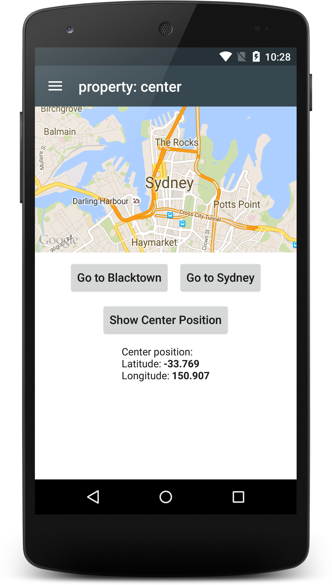

# tabris-maps-example
This is an example [Tabris.js](https://tabrisjs.com) project to demonstrate how the [tabris-maps](https://github.com/eclipsesource/tabris-maps) custom widget can be used.

## Screenshots

