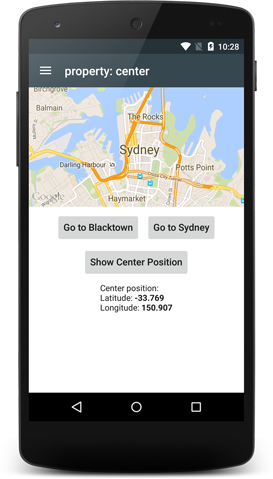
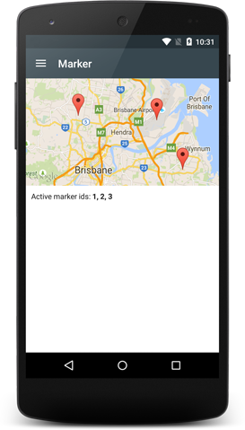

# tabris-maps-example
This is an example [Tabris.js](https://tabrisjs.com) project that demonstrates how to use features of the  [tabris-maps](https://github.com/eclipsesource/tabris-maps) custom widget.
It consist of a native app for iOS and Android mobile devices.
The app provides a completely native user interface centered around the native map support available on both platforms. The app itself is written in Java Script.

## Running the example
The easiest way to run tabris-maps-example as a native app on you mobile device is the build service provided on [tabrisjs.com](https://tabrisjs.com).

Visit our documentation to learn more about [Building a Tabris.js App](https://tabrisjs.com/documentation/latest/build).

### Using the online build service
1. Fork the repository of tabris-maps-example (alternatively you can create your own project using the tabris-maps plugin).
1. Create a Tabris.js app on https://tabrisjs.com/[YOUR_USER]/apps/ with your GitHub fork (or own GitHub project).
1. Add an environment variable `API_KEY_FOR_ANDROID` with your [Google Maps API key](https://developers.google.com/maps/documentation/android-api/signup) as a value on the settings tab of your app.  
 **ATTENTION:** iOS does not require any API keys to work.
1. On Android select the _signing key_ for the app whose fingerprint was registered on the Google Developers Console. On iOS just choose the _signing key_ that fits your device and app.
1. Trigger a build.

**ATTENTION:** If you build your app in debug mode ("debug" toggle button switched to "on" in the "Settings" tab of you build on https://tabrisjs.com) the Tabris.js build service generates a new internal debug key for each build to sign your app. To find the SHA1 of that key, install the app produced by the debug build on an Android device, connect with ```adb``` to your device and look for the following output:
```
I/b       (16793): Sending API token request.
D/map.holder(16793): map is ready
E/b       (16793): Authentication failed on the server.
E/Google Maps Android API(16793): Authorization failure.  Please see https://developers.google.com/maps/documentation/android/start for how to correctly set up the map.
E/Google Maps Android API(16793): In the Google Developer Console (https://console.developers.google.com)
E/Google Maps Android API(16793): Ensure that the "Google Maps Android API v2"is enabled.
E/Google Maps Android API(16793): Ensure that the following Android Key exists:
E/Google Maps Android API(16793):   API Key: XXX-YOUR-API-KEY-HERE-XXX
E/Google Maps Android API(16793):   Android Application (<cert_fingerprint>;<package_name>): YYY-SHA1-HERE-YYY;com.eclipsesource.tabris.maps.example
```
Then use the SHA1 from that output (marked with ```YYY-SHA1-HERE-YYY``` above) with your maps API key in the Google developer console. Update the API key you use in the debug build. Do not generate a new one. Be aware, that the build service will generate a new debug key for every build in debug mode and that propagation of the newly associated SHA1 takes some minutes.

### Build locally for Android
1. Clone the repository.
1. Make sure your Android debug certificate's fingerprint is registered with the API key you will use for Google Maps on Google Developers Console/API & auth/Credentials (https://console.developers.google.com/project/[YOUR_PROJECT_NAME]/apiui/credential)
1. Download the latest Android Cordova platform from https://tabrisjs.com/download
1. Execute the following:
```sh
export API_KEY_FOR_ANDROID=[YOUR_GOOGLE_MAPS_API_KEY]
cordova platform add [LOCATION_TO_THE_CORDOVA_PLATFORM]
cordova run
```

### Build locally for iOS
1. Clone the repository.
1. Download latest iOS Cordova platform from https://tabrisjs.com/download and add it to your project (`cordova platform add [LOCATION_TO_THE_CORDOVA_PLATFORM]`)
1. Execute `cordova run`

## Screenshots


